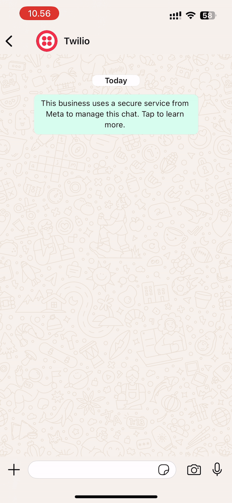
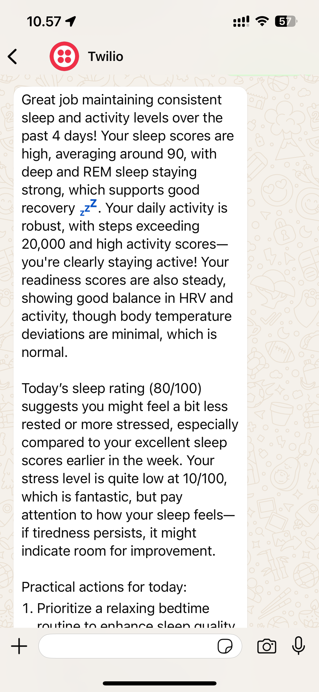
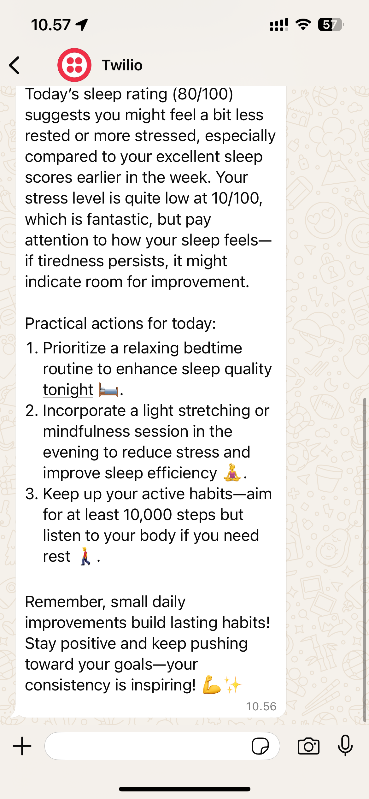

# AI-Powered WhatsApp Mood Tracking Agent

A WhatsApp bot that collects sleep and stress ratings, combines them with Oura Ring data, and provides personalized health insights using GPT-4.






## Features

- WhatsApp integration for easy interaction
- Oura Ring data integration for sleep, readiness, activity, and workout metrics
- GPT-4 powered health insights and recommendations
- Simple rating system for sleep quality and stress levels
- Automated daily check-ins

## Prerequisites

- Python 3.8 or higher
- Oura Ring account and API token
- OpenAI API key
- Twilio account with WhatsApp sandbox
- ngrok for webhook tunneling

## Installation

1. Clone the repository:
```bash
git clone <repository-url>
cd <repository-name>
```

2. Create and activate a virtual environment:
```bash
python -m venv venv
source venv/bin/activate  # On Windows: venv\Scripts\activate
```

3. Install required packages:
```bash
pip install -r requirements.txt
```

4. Create a `.env` file with your credentials:
```
TOKEN=your_oura_ring_token
OPENAI=your_openai_api_key
TWILIO_ACCOUNT_SID=your_twilio_account_sid
TWILIO_AUTH_TOKEN=your_twilio_auth_token
WHATSAPP_TO_NUMBER=your_whatsapp_number
```

## Project Structure

- `whatsapp.py`: Handles WhatsApp communication and conversation flow
- `openai_model.py`: Manages GPT-4 integration and health insights generation
- `fetch_oura_data.py`: Handles Oura Ring API interactions
- `requirements.txt`: Lists all Python dependencies

## Usage

1. Start the WhatsApp server:
```bash
python whatsapp.py
```

2. In a new terminal, start ngrok:
```bash
ngrok http 5001
```

3. Configure Twilio webhook:
   - Go to Twilio Console → Messaging → Try it out → Send a WhatsApp message
   - In Sandbox Settings, set "WHEN A MESSAGE COMES IN" to your ngrok URL + "/webhook"
   - Make sure to select HTTP POST as the method

4. The bot will:
   - Send an initial question about sleep quality
   - Ask for stress level rating
   - Generate personalized health insights based on your ratings and Oura Ring data

## Conversation Flow

1. Bot asks: "How well did you sleep last night? (1-100)"
2. User responds with a number
3. Bot asks: "How stressed do you feel today? (1-100)"
4. User responds with a number
5. Bot generates and sends personalized health insights

## Error Handling

The bot handles various scenarios:
- Invalid number inputs
- Empty messages
- API connection issues
- Server errors

 